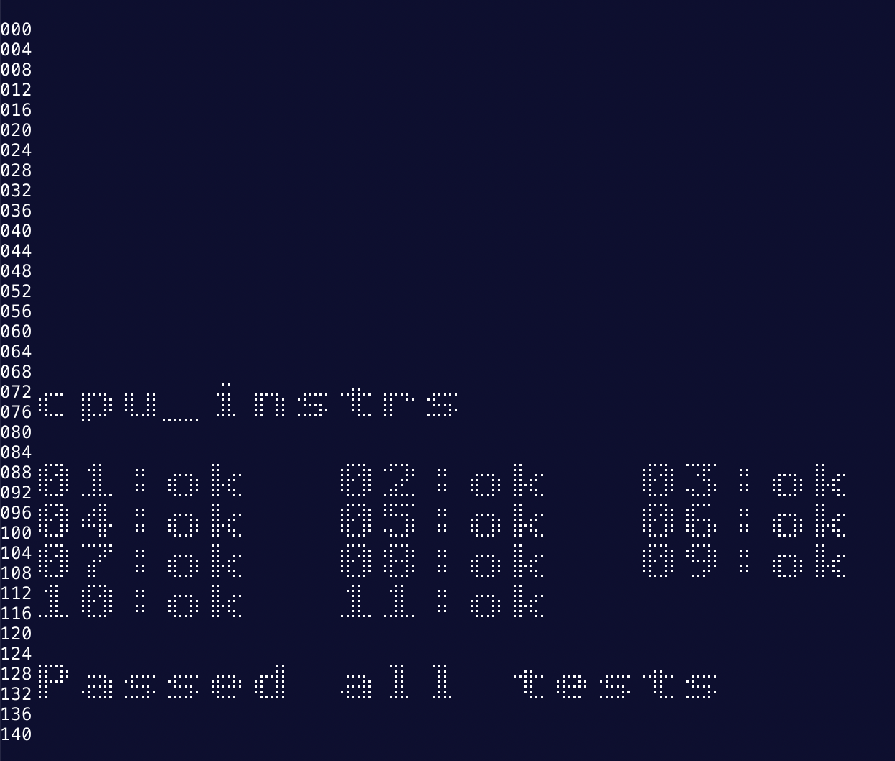
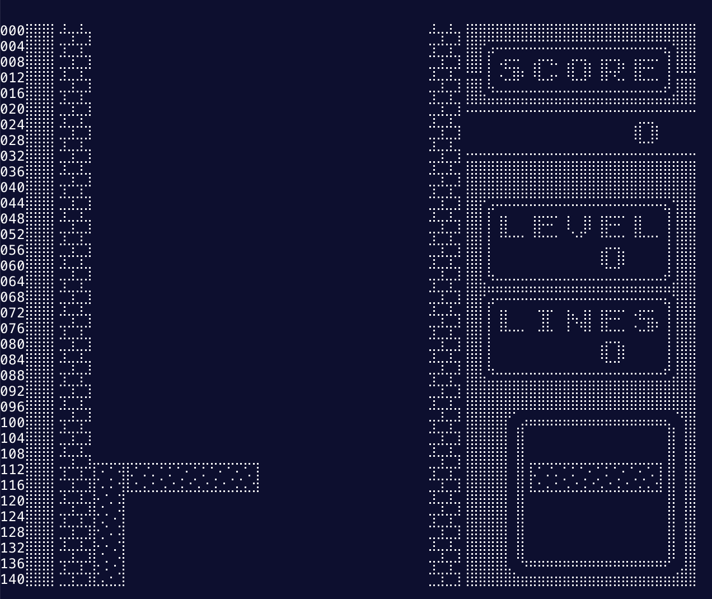

# Rust で作るゲームボーイエミュレータ

Rust の勉強を兼ねてるので標準ライブラリ縛りで実装しています。  
そのため出力先はターミナルで、点字を使って描画しています。  
まだまだ実装中のためバグだらけですが、[GBAダンパー V3](https://www.amazon.co.jp/gp/product/B0838CVZ49)で吸い出したテトリスが何となくプレイできるところまでは実装済みです。

```shell
cargo run <path_to_rom>
```

### Examples

```shell
# https://github.com/retrio/gb-test-roms/blob/master/cpu_instrs/cpu_instrs.gb
cargo run cpu_instrs.gb > /dev/null
```



```shell
# Tetris Data loaded using GBA Dumper v3
# GBA Dumper v3: https://www.amazon.co.jp/gp/product/B0838CVZ49
cargo run Tetris.gb > /dev/null
```




## 参考リンク

- [Rustでゲームボーイエミュレータを自作した話](https://mjhd.hatenablog.com/entry/2021/04/14/221813)
- [ゲームボーイのエミュレータを自作した話](https://keichi.dev/post/write-yourself-a-game-boy-emulator/)
- [Pan Docs](https://gbdev.io/pandocs/)
- [Game Boy CPU (SM83) instruction set](https://gbdev.io/gb-opcodes/optables/)
- [GB Spec](https://w.atwiki.jp/gbspec/)
- [GBEDG](https://hacktixme.ga/GBEDG/)
- [Baekalfen/PyBoy](https://github.com/Baekalfen/PyBoy)
- [retrio/gb-test-roms](https://github.com/retrio/gb-test-roms)
